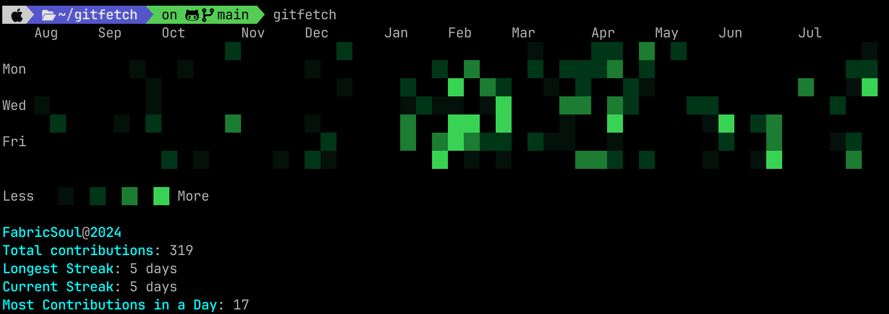

# Gitfetch

Gitfetch is a command-line information tool written in Rust, inspired by [Neofetch](https://github.com/dylanaraps/neofetch). It provides a visually appealing way to display Git contribution information.


## Table of Contents

- [Features](#features)
- [Installation](#installation)
- [Usage](#usage)
- [Configuration](#configuration)
- [Troubleshooting](#troubleshooting)
- [Roadmap](#roadmap)
- [Contributing](#contributing)
- [License](#license)

## Features

- Prints out contribution information similar to how Neofetch displays system information
- Automatically detects the global Git user
- Allows specifying any user and year for contribution data
- Customizable contribution graph and output color

## Installation

### Prerequisites

- Git (optional, for global user detection)

### Arch Linux

```bash
yay -S gitfetch
```

or

```bash
paru -S gitfetch
```

### MacOS

```bash
brew tap fabricsoul/gitfetch https://github.com/FabricSoul/gitfetch
brew install gitfetch
```

### Installing from crates.io

Install Gitfetch directly from crates.io using Cargo:

```bash
cargo install --locked gitfetch
```

## Usage

1. Generate a new [GitHub Token](https://github.com/settings/tokens) with the `read:user` scope to fetch data from GitHub.

2. Add your token to Gitfetch:

   ```bash
   gitfetch add-token <your-token-here>
   ```

3. Run Gitfetch:

   ```bash
   gitfetch
   ```

### Optional Arguments

- `-u` or `--user`: Specify a GitHub username
- `-y` or `--year`: Specify a year for contribution data

Example:

```bash
gitfetch -u FabricSoul -y 2023
```

## Configuration

Gitfetch can be customized using a configuration file located at `~/.config/gitfetch/config.toml`. This file allows you to personalize the appearance and behavior of Gitfetch.

### Configuration File Structure

The `config.toml` file is divided into three main sections:

1. `[graph_colors]`: Defines the colors for different contribution levels in the graph.
2. `[text_colors]`: Sets the color for informational text.
3. `[graph_data]`: Configures the thresholds for contribution levels.

### Detailed Configuration Options

#### [graph_colors]

This section defines the colors for the contribution graph. Colors are specified in RGB format.

```toml
[graph_colors]
level1 = "39,168,68"   # Light green for low contributions
level2 = "45,135,67"   # Medium green
level3 = "31,97,51"    # Dark green
level4 = "23,70,38"    # Very dark green for high contributions
```

- Each level represents a different intensity of contributions.
- Values should be comma-separated RGB values (0-255 for each component).

#### [text_colors]

This section sets the color for the informational text displayed alongside the graph.

```toml
[text_colors]
info_color = "86,182,194"  # Light blue for info text
```

- Specified as comma-separated RGB values.

#### [graph_data]

This section defines the thresholds for each contribution level in the graph.

```toml
[graph_data]
percentiles = [30, 60, 80, 100]
```

- The `percentiles` array contains four values representing the breakpoints for each contribution level.
- Values are percentiles of the user's contribution range.
- In this example:
  - 0-30th percentile: level1 color
  - 31-60th percentile: level2 color
  - 61-80th percentile: level3 color
  - 81-100th percentile: level4 color

### Example Configuration

Here's a complete example of a `config.toml` file:

```toml
[graph_colors]
level1 = "39,168,68"
level2 = "45,135,67"
level3 = "31,97,51"
level4 = "23,70,38"

[text_colors]
info_color = "86,182,194"

[graph_data]
percentiles = [30, 60, 80, 100]
```

### Applying Configuration Changes

After modifying the `config.toml` file:

1. Save the changes.
2. Run Gitfetch again. The new configuration will be automatically applied.

### Resetting to Default Configuration

To reset to the default configuration:

1. Delete the `config.toml` file.
2. Run Gitfetch. A new `config.toml` file with default values will be created.

## Troubleshooting

If you encounter issues with your configuration:

- Ensure all RGB values are within the 0-255 range.
- Check that the `percentiles` array has exactly four values.
- Verify that the `config.toml` file is properly formatted TOML.

If problems persist, you can temporarily rename or remove the `config.toml` file to use the default configuration while troubleshooting.

[... rest of the README unchanged ...]

## Roadmap

- [x] Customize the graph color
- [x] Customize output text color
- [x] Customize graph display
- [x] Use `git` to get username
- [x] Specify a user
- [x] Specify a year
- [x] Display highest contribution
- [x] Display longest streak
- [x] Display current streak
- [ ] Add support for other Git hosting platforms

## Contributing

We welcome contributions to Gitfetch! Here's how you can help:

1. Fork the project
2. Create your feature branch (`git checkout -b feature/AmazingFeature`)
3. Commit your changes (`git commit -m 'Add some AmazingFeature'`)
4. Push to the branch (`git push origin feature/AmazingFeature`)
5. Open a pull request

## License

This project is licensed under the GPL-3.0 License - see the [LICENSE](LICENSE) file for details.

---

**Note:** Gitfetch is under active development. Features and documentation may be incomplete or subject to change. We appreciate your feedback and contributions!
